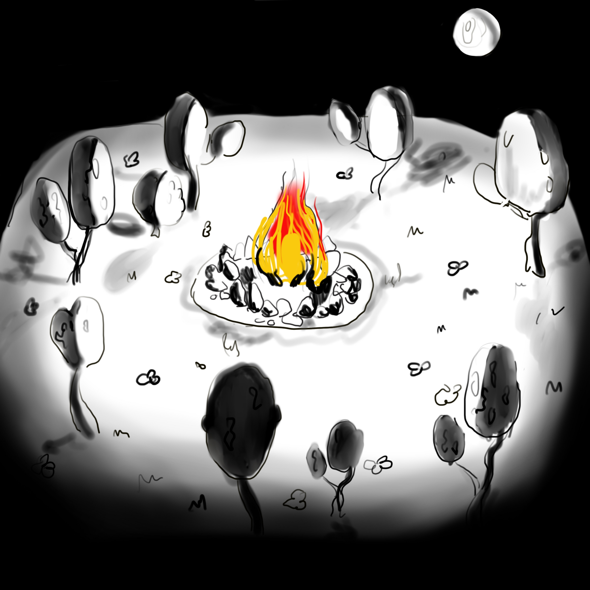

### Alexandra Lagutova (324449) & Ahmed Elalamy (324610)
## Abstract

{width="500px"}  

{width="500px"}  

When thinking about what we would like to do for this project, we immediately knew we wanted to do something related to particles and fire as well. While brainstorming, we realized that particles could give us way more possibilities than just a fire, which is why we thought we could add to the artistic effect by creating a day and night cycle, making all our different systems evolve throughout. We therefore chose to go in this direction, creating a scene with a full day and night cycle. This scene lies at the top of a cloud in the sky. At night, the fire in the middle illuminates the trees around, while during daytime, it disappears and goes to smoke. We also created little fireflies that fly around during nighttime.  

## Technical approach

- The day and night cycle was realized using many sinusoidal functions that would make the elements appear and disappear, or change color based on either the day or the night.  
- The particles are rendered using the 'points' primitive of regl. These have the added benefit of being rendered as billboards in an optimized way by regl.  
- We pass the states as textures, where the rgba channels are used to convey the (x,y,z) positions, the age of the particle, its lifetime and its starting time.
- In order to run our particle systems, we have two pipelines: first we have an update pipeline which, based on a combination of current and previous states of each particle decides on its next state, i.e. its next position, whether they continue to live or have to be reset, etc... Our second pipeline draws the particles based on the state computed in the update pipeline.  
- We used perlin noise and turbulence in our particle systems shaders to create a more realistic texture and a more realistic movements to make them more lifelike. We also made the sizes of particles, their lifetime and their alpha value vary to add more complexity. 

## Results

We find that this video resumes quite well the results of our project, we also added a few screenshots.

<iframe
    width="640"
    height="480"
    src="https://www.youtube.com/embed/BNaJHnsKTIg"
    frameborder="0"
    allowfullscreen
>
</iframe>

## Сontributions from each team member 
- Ahmed has done the implementation of the clouds and the smoke partcile systems. He had also implemented the day night cycle.
- Alexandra has done the implementation of the fire and the fireflies. She had also done the modifications of the blender model. 
- Overall it was a group effort, we also helped each other for other tasks. We felt like we have done each 50% of the project. 

## Resources
- Blender  
- WebGL  
- regl  
- [Inspiration for the model](https://sketchfab.com/3d-models/teacup-house-a9a4d881c4f6458394e4fe66fc575216#download)  
- Particle systems and animation from "OpenGL 4 Shading Language Cookbook - Second Edition"  
- Github Gist code by Peter Beshai to understand how to render particles in regl. [link here](https://gist.github.com/pbeshai/dbed2fdac94b44d3b4573624a37fa9db)
- [Reference to make the fire more realistic] (http://jiajianzhang.com/?p=289)
