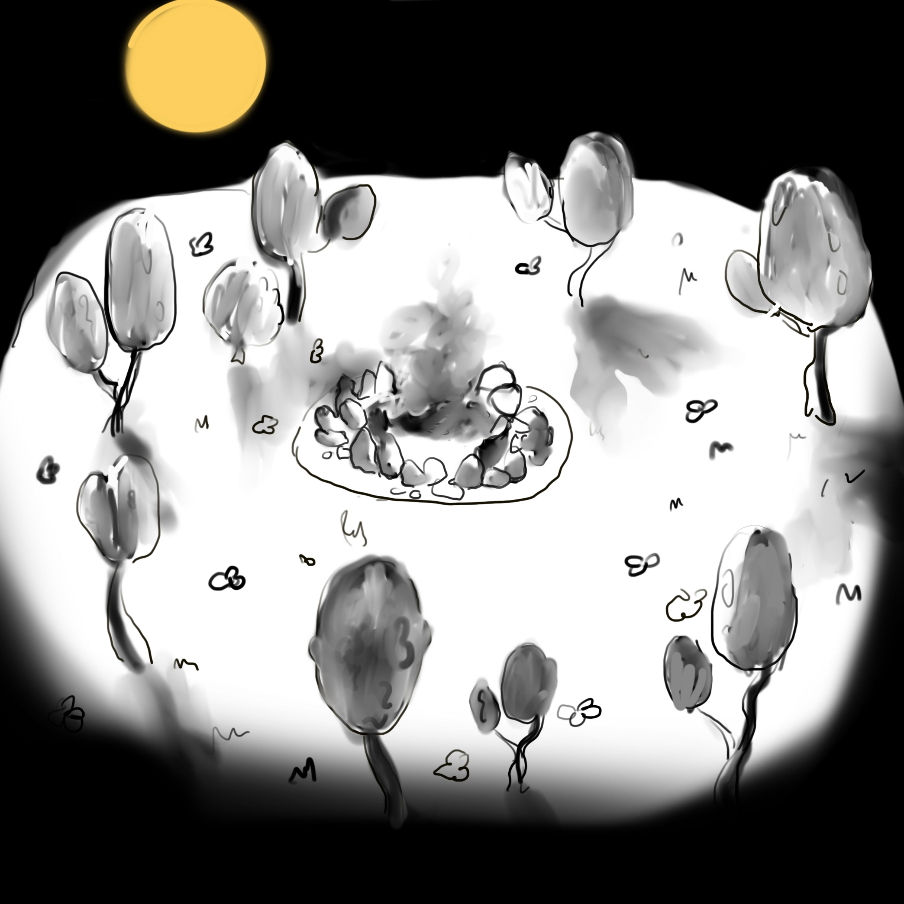

### Alexandra Lagutova (324449) & Ahmed Elalamy (324610)

{width="500px"}  

{width="500px"}  

{width="500px"}

## Title and Summary

Our project will consist of an animation of a little campfire in the forest, and its life cycle throughout day and night. Along with the cycle of day and night, other animations will make the scene alive. We plan on working with WebGL and the homework framework that we now know better.  

## Goals and Deliverables

Our baseplan is to create an artistic scene, with the cycle of day and night and its influence on our campfire. We believe that this will be the minimum we should do to get a passing grade.  

As extentions, we would like to:  

- add fireflies at night in the forest,
- make some little characters and animate them,
- add some interactivity features.

## Schedule

Week 1: Make the whole blender model (Alexandra) and integrate it in WebGL + Begin working on the fire particle function (Ahmed).  

Week 2: Work on the particles function for the fire/smoke (Ahmed) + Put in place the day and night cycle and integrate shading (Alexandra).  

Week 3: Integrate the fire within the blender model (Ahmed) and add shading and lighting based on the fire (Alexandra).  

Week 4: Create the fireflies model (Ahmed) and integrate them in the scene (shadows, lighting, movement) (Alexandra).  

Week 5: Create characters (Alexandra) and animate them (Ahmed).  

# Feedback: May 12th 2023

Unfortunately, due to other projects and other obligations, we haven't had the most time available to advance as much as we would've liked. It might also be possible that we underestimated the time that things were going to take. Our schedule should clear up starting next week so we will focus more on this project.

We were able to make our scene in blender. We however had a lot of issues with importing it with the correct texture in WebGL.

{width="500px"}  

{width="500px"}

Then, we also started working on particles. This was mainly some research about how to implement it, and so far we have a billboard of a cloud/smoke-like particles for which the movement function is a pseudorandom path. We are still working on how to implement it within our scene, but following the ICG 2021 resource on billboarding that was providing to us by the teaching team, we have a pretty good understanding of what we need to do for it to be integrated in our scene.

{width="500px"}  

We also planned on how the day and night cycle would be implemented: that will be done by passing the simulation time in our shaders and changing colors and things based on this simulation time.

## Update on the schedule
It seems appearant to us that some of our ideas for extensions might have been too ambitious. However, we still would like to make some of the extensions present in the grading contract. Therefore, what we would like to have finished before the final deadline is:

- Finish the core of our project by creating the fire and smoke dynamic of our campfire.
- Create clouds around the scene (with particles as well).
- Integrate the day and night concept in the most detailled way possible.

Then, if time allows:

- Add some fireflies particles to contribute to the artistic effect of the scene.
- Add a bloom effect on the fire to make it more glowy.

# Resources
- Blender  
- WebGL  
- [Inspiration for the model](https://sketchfab.com/3d-models/teacup-house-a9a4d881c4f6458394e4fe66fc575216#download)  
- Particle systems and animation from "OpenGL 4 Shading Language Cookbook - Second Edition"  
- Github Gist code by Peter Beshai to understand how to render particles in regl. [link here](https://gist.github.com/pbeshai/dbed2fdac94b44d3b4573624a37fa9db)
