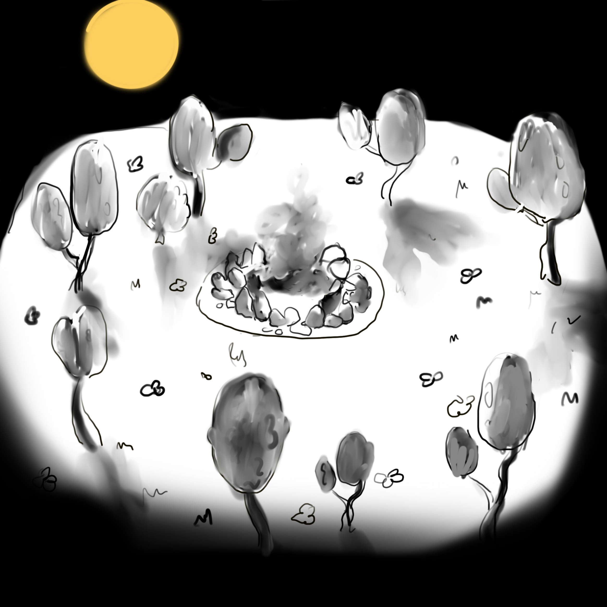

### Alexandra Lagutova (324449) & Ahmed Elalamy (324610)

{width="500px"}  

{width="500px"}  

{width="500px"}

# Title and Summary

Our project will consist of an animation of a little campfire in the forest, and its life cycle throughout day and night. Along with the cycle of day and night, other animations will make the scene alive. We plan on working with WebGL and the homework framework that we now know better.  

# Goals and Deliverables

Our baseplan is to create an artistic scene, with the cycle of day and night and its influence on our campfire. We believe that this will be the minimum we should do to get a passing grade.  

As extentions, we would like to:  

- add fireflies at night in the forest,
- make some little characters and animate them,
- add some interactivity features.

# Schedule

Week 1: Make the whole blender model (Alexand + Begin working on the fire particle function.  

Week 2: Work the particles function for the fire + Put in place the day and night cycle.  

Week 3: Integrate the fire within the blender model and add shading and lighting based on the fire.  

Week 4: Integrate fireflies.  

Week 5: Create characters animations.  

# Resources
- Blender  
- WebGL  
- https://sketchfab.com/3d-models/teacup-house-a9a4d881c4f6458394e4fe66fc575216#download